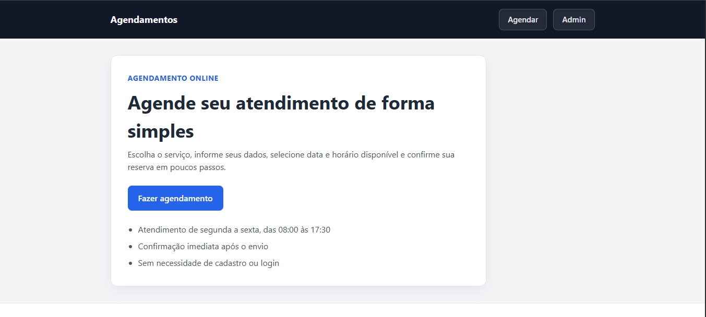
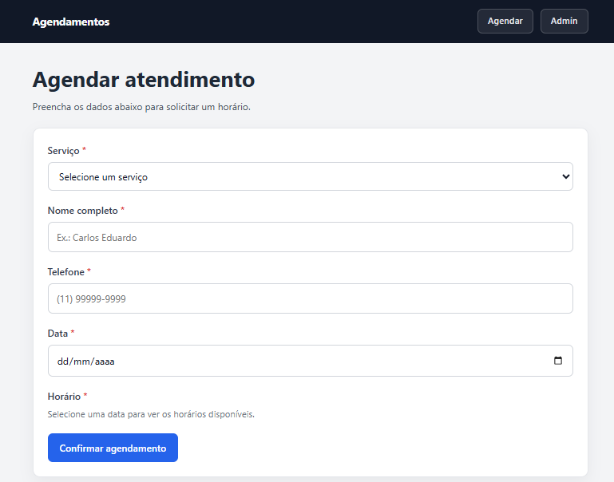
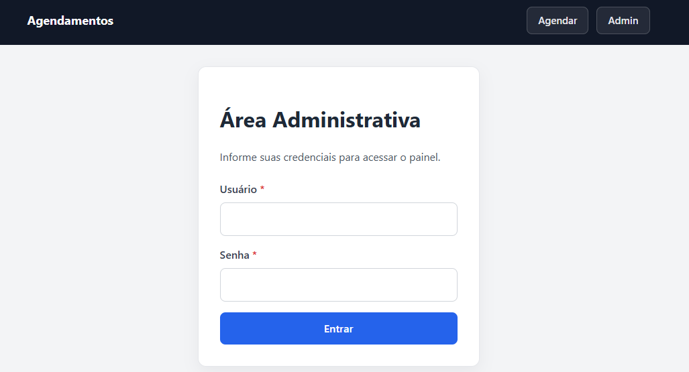
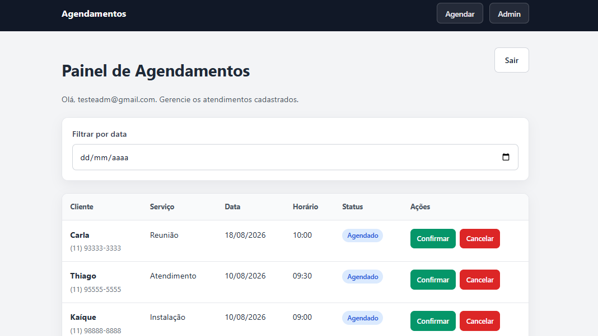

# Aplicação de Agendamentos

Sistema genérico de gerenciamento de agendamentos com área do cliente e área administrativa.

## Decisões técnicas

- A arquitetura do projeto foi estruturada como um monorepo, com o objetivo de centralizar e facilitar o desenvolvimento e a organização da aplicação. No frontend, utilizei Vite + React por já possuir familiaridade com essas tecnologias. No backend, utilizei Node.js + Express. Para persistência dos dados, utilizei MongoDB + Mongoose, JWT para autenticação administrativa, Zod para validação e Context API + React Hooks para gerenciamento de estado.
- As decisões técnicas e arquiteturais estão detalhadas nos arquivos PROJECT_ARCHITECTURE.md e IMPLEMENTATION_DECISIONS.md. Esses arquivos foram feitos para adotar como método de planejamento do projeto e para entrgar mais contexto para a IA poder orientar com mais eficiência no decorrer do projeto.


## Print das Telas do Projeto

### Área do Call to Action



###  Área do Cliente



### Área de login do Adminstrador



### Área do Administrador




## Documentação

- [BUSINESS_RULES.md](./BUSINESS_RULES.md) — regras funcionais
- [PROJECT_ARCHITECTURE.md](./PROJECT_ARCHITECTURE.md) — arquitetura técnica
- [IMPLEMENTATION_DECISIONS.md](./IMPLEMENTATION_DECISIONS.md) — decisões de implementação 


## Ferramentas de Inteligência Artificial

- ChatGPT — apoio na análise de requisitos, regras de negócio, arquitetura, documentação e resolução de problemas durante o desenvolvimento.
- Cursor — apoio na implementação, análise e revisão do código.

## Credenciais de acesso do Login do Adm

- Login: testeamd@gmail.com
- Senha: 180180360

## Estrutura

```text
aplicacao-de-agendamento/
├── backend/                    # API REST (Node.js + Express)
│   ├── src/
│   │   ├── config/             # Conexão MongoDB
│   │   ├── controllers/        # Camada HTTP
│   │   ├── middlewares/        # JWT e tratamento de erros
│   │   ├── models/             # Schema Appointment (Mongoose)
│   │   ├── routes/             # Endpoints da API
│   │   ├── services/           # Regras de negócio
│   │   ├── validators/         # Validações Zod
│   │   ├── utils/              # Datas, telefone, erros
│   │   ├── test/               # Testes unitários e de integração
│   │   ├── app.js
│   │   └── server.js
│   └── .env.example
│
├── frontend/                   # Interface (React + Vite)
│   ├── src/
│   │   ├── components/         # UI reutilizável
│   │   ├── contexts/           # AuthContext, BookingContext
│   │   ├── hooks/              # useAvailableTimes
│   │   ├── pages/              # Home, BookingForm, Confirmation, Admin*
│   │   ├── routes/             # AppRoutes, ProtectedRoute
│   │   ├── services/           # Cliente HTTP e chamadas à API
│   │   ├── utils/              # Validações e formatações
│   │   ├── App.jsx
│   │   └── main.jsx
│   ├── vite.config.js
│   └── .env.example
│
├── docs/
│   ├── images/                 # Screenshots das telas
│   └── source/       # BUSINESS_RULES, ARCHITECTURE, DECISIONS
│
├── package.json                # Scripts do monorepo
└── README.md
```

## Pré-requisitos

- Node.js 18+
- npm
- MongoDB Atlas (ou instância local)

## Configuração

### Backend

```bash
cd backend
cp .env.example .env
# Preencha MONGODB_URI, JWT_SECRET, ADMIN_USER e ADMIN_PASSWORD
npm install
npm run dev
```

### Frontend

```bash
cd frontend
cp .env.example .env
# Ajuste VITE_API_URL se necessário
npm install
npm run dev
```

### Monorepo (raiz)

```bash
npm install
npm run dev
```

## Stack

| Camada    | Tecnologias              |
| --------- | ------------------------ |
| Frontend  | React, Vite, React Router |
| Backend   | Node.js, Express, Mongoose, Zod, JWT |
| Banco     | MongoDB                  |

## Scripts (raiz)

| Script          | Descrição                          |
| --------------- | ---------------------------------- |
| `npm run dev`   | Inicia frontend e backend          |
| `npm run dev:frontend` | Apenas frontend             |
| `npm run dev:backend`  | Apenas backend              |
| `npm run build` | Build de produção do frontend      |
| `npm run start` | Inicia backend em produção         |
